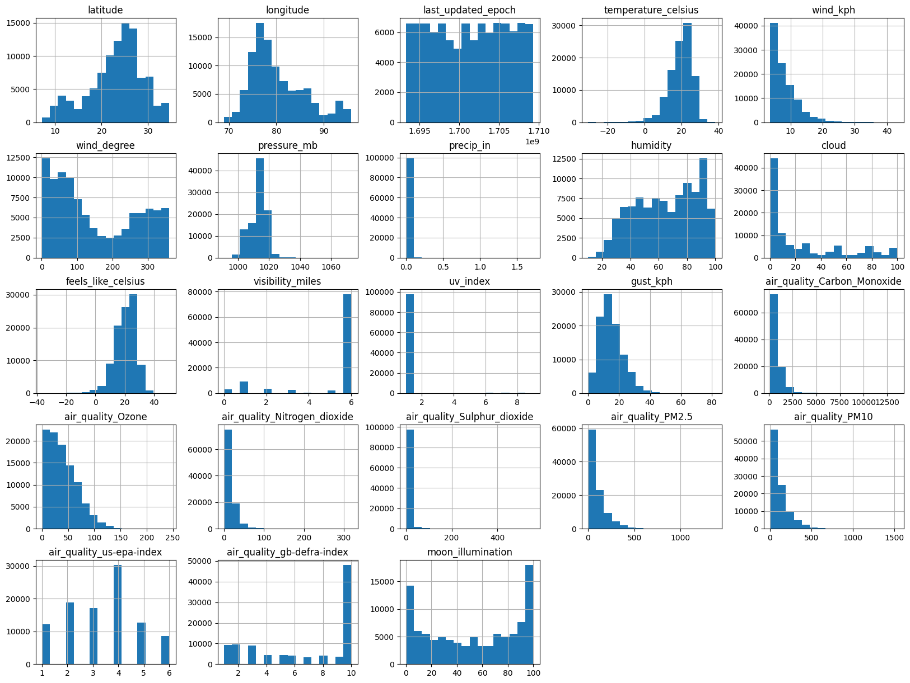

# ☁️ Indian Weather Prediction Project

---

## 📌 Project Overview

This project focuses on predicting key weather parameters in India — including `temperature_celsius`, `feels_like_celsius`, and `cloud` coverage — using machine learning models. It leverages a rich dataset from the Indian Weather Repository to train and evaluate a suite of regression algorithms.

---

## 🛠 Key Features

- Data preprocessing: cleaning, feature selection, and scaling
- Visual exploration with histograms, heatmaps, scatter plots
- Machine learning models: Linear, Ridge, Lasso, Random Forest, Gradient Boosting, XGBoost
- Evaluation using R², MSE, RMSE, MAE
- K-Fold Cross Validation for performance robustness

---

## 🧠 How It Works

1. Load dataset (`IndianWeatherRepository.csv`)
2. Clean and preprocess data
3. Visualize data relationships and trends
4. Split dataset into train/test sets
5. Scale features with StandardScaler
6. Train multiple regression models
7. Evaluate model accuracy and visualize predictions

---

## 📁 Project Files

| File Name                      | Description                                      |
|--------------------------------|--------------------------------------------------|
| [IndianWeatherRepository.ipynb](arshdeep.ipynb)  | Main Python notebook                               |
| IndianWeatherRepository.csv    | Weather dataset                                  |
| [histogram.png](histogram.png) | Feature distribution histograms                  |
| [correlation.png](correaltion.png) | Correlation heatmap                              |
| [air_quality_vs_temp.png](air_quality_vs_temp.png ) | Air quality vs. temperature scatter plot         |
| [newplot1.png](newplot1.png) - [newplot5.jpg](newplot5.png)    | Additional visualizations (sunburst, polar, etc.)|

---

---

## 🔗 Dataset Access

The dataset used in this project is publicly available on Kaggle:

📂 [Indian Weather Repository – Daily Snapshot](https://www.kaggle.com/datasets/nelgiriyewithana/indian-weather-repository-daily-snapshot)

> ℹ️ After downloading, rename the file to `IndianWeatherRepository.csv` and place it in the same folder as your script before running the project.

---

## ▶️ How to Run

1. Install required libraries:

```bash
pip install pandas matplotlib seaborn plotly scikit-learn xgboost
```

2. Ensure the dataset CSV is in the same folder as the script.

3. Run the script:

```bash
python IndianWeatherRepository.py
```

---

## 📈 Results Summary

### 🔸 Temperature (°C)

| Model              | R²   | MSE   | RMSE | MAE  |
|--------------------|------|-------|------|------|
| Linear Regression  | 0.72 | 10.79 | 3.28 | 2.56 |
| Lasso              | 0.72 | 10.82 | 3.29 | 2.56 |
| Ridge              | 0.72 | 10.79 | 3.28 | 2.56 |
| Gradient Boosting  | 0.86 | 5.55  | 2.35 | 1.80 |
| Random Forest      | 0.93 | 2.60  | 1.61 | 1.08 |
| XGBoost            | 0.91 | 3.44  | 1.85 | 1.37 |

✅ Best performer: Random Forest

### 🔸 Feels Like Temperature (°C)

| Model              | R²   | MSE   | RMSE | MAE  |
|--------------------|------|-------|------|------|
| Linear Regression  | 0.74 | 14.25 | 3.77 | 2.94 |
| Lasso              | 0.74 | 14.29 | 3.78 | 2.94 |
| Ridge              | 0.74 | 14.25 | 3.77 | 2.94 |
| Gradient Boosting  | 0.86 | 7.84  | 2.80 | 2.16 |
| Random Forest      | 0.93 | 3.64  | 1.91 | 1.31 |
| XGBoost            | 0.91 | 4.73  | 2.18 | 1.64 |

✅ Best performer: Random Forest

---

## 📊 Sample Visualizations

### Feature Distributions


### Correlation Heatmap


### Temperature vs Air Quality


---

## 🚀 Future Improvements

- Implement LSTM/GRU for time-series prediction
- Build a real-time web dashboard (e.g., Flask + Streamlit)
- Incorporate external APIs or satellite weather feeds
- Use deep feature engineering for seasonal effects
- Deploy as a cloud-based ML service

---

## 👤 Author

**Name:** Arshdeep Yadav  
**Department:** B.Tech Computer Science & Engineering  
**Institution:** R.E.C. Kannauj
